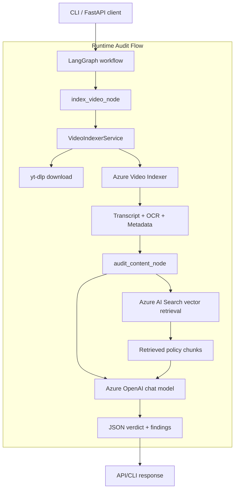
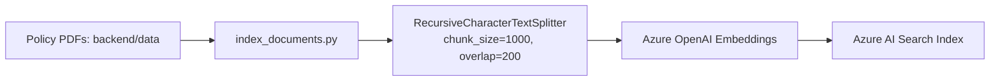

# Brand Guardian AI

Brand Guardian AI is an **LLM-powered compliance auditing system for marketing videos**.
It ingests a YouTube video, extracts speech/on-screen text, retrieves relevant policy guidance from a vector knowledge base, and returns a structured compliance report (`PASS`/`FAIL`, violations, and summary).

> **Current scope:** This repo is an end-to-end backend prototype with CLI + FastAPI entrypoints and Azure-first integrations (Video Indexer, OpenAI, AI Search, App Insights).

---

## 1) Problem this project solves

Manual ad/compliance review is expensive and inconsistent when teams are shipping lots of content.
This project automates first-pass review by combining:

- **Evidence extraction** from videos (transcript + OCR),
- **Rule-grounded retrieval** from your policy PDFs,
- **Deterministic orchestration** (LangGraph),
- **Structured machine-readable output** for downstream workflows.

This design reduces “hallucinated policy advice” risk versus plain prompting because retrieval injects organization-specific policy context at runtime.

---

## 2) System architecture (high level)



### Knowledge ingestion architecture (offline / scheduled)



### Existing image artifact (from repo)


---

## 3) Execution flow in detail

## Step A — Entry points

You can start audits via:

- **CLI simulation** (`main.py`)
- **HTTP API** (`POST /audit` in `backend/src/api/server.py`)

Both build initial graph state:

- `video_url`
- `video_id`
- `compliance_results=[]`
- `errors=[]`

## Step B — Node 1: Index video (`index_video_node`)

`index_video_node` orchestrates media ingestion and extraction:

1. Verifies URL shape (YouTube domain expected).
2. Downloads video locally using `yt-dlp`.
3. Uploads local file to Azure Video Indexer.
4. Polls indexing status until processed.
5. Extracts:
   - transcript text,
   - OCR text lines,
   - basic metadata.

Error path sets `final_status=FAIL` and appends diagnostic text into `errors`.

## Step C — Node 2: Audit content (`audit_content_node`)

`audit_content_node` performs RAG + reasoning:

1. If transcript missing, returns fail-fast response.
2. Initializes:
   - Azure chat LLM,
   - Azure embeddings,
   - Azure Search vector store.
3. Builds query from transcript + OCR.
4. Retrieves top-k policy chunks from vector index.
5. Injects retrieved rules into strict JSON prompt.
6. Parses model output into:
   - `compliance_results`
   - `final_status`
   - `final_report`

It also strips markdown code fences if the model wraps JSON in ```json blocks.

## Step D — Response

The graph returns final state consumed by:

- CLI pretty-print report,
- FastAPI `AuditResponse` payload.

---

## 4) Core architecture decisions

- **LangGraph over ad-hoc script chaining**: clearer stateful DAG + easier extensibility.
- **Azure Video Indexer for extraction**: offloads speech/OCR complexity.
- **Azure AI Search as retriever**: scalable vector retrieval over policy corpus.
- **Strict JSON target schema**: supports downstream automation and deterministic UI rendering.
- **Telemetry hook**: optional Azure Monitor instrumentation for production visibility.

---

## 5) Repository map

```text
.
├── README.md
├── main.py
├── pyproject.toml
├── Project2_Langgraph_Architecture.png
├── docs/
│   ├── youtube-ad-specs.pdf
│   └── 1001a-influencer-guide-508_1.pdf
├── backend/
│   ├── Dockerfile
│   ├── data/
│   │   ├── youtube-ad-specs.pdf
│   │   └── 1001a-influencer-guide-508_1.pdf
│   ├── scripts/
│   │   ├── index_documents.py
│   │   └── explanation.txt
│   └── src/
│       ├── api/
│       │   ├── server.py
│       │   └── telemetry.py
│       ├── graph/
│       │   ├── state.py
│       │   ├── nodes.py
│       │   └── workflow.py
│       └── services/
│           └── video_indexer.py
└── azure_functions/
    ├── function_app.py        # currently empty scaffold
    ├── host.json              # currently empty scaffold
    ├── local.settings.json    # currently empty scaffold
    └── requirements.txt       # currently empty scaffold
```

---

## 6) Data model contracts

### Graph state (`VideoAuditState`)

- **Inputs**: `video_url`, `video_id`
- **Extraction**: `local_file_path?`, `video_metadata`, `transcript?`, `ocr_text[]`
- **Outputs**: `compliance_results[]`, `final_status`, `final_report`
- **Diagnostics**: `errors[]`

### Violation object (`ComplianceIssue`)

- `category` (e.g., disclosure, claim validation)
- `description`
- `severity` (e.g., CRITICAL/WARNING)
- `timestamp` (optional)

---

## 7) API specification

## `POST /audit`

### Request

```json
{
  "video_url": "https://youtu.be/dT7S75eYhcQ"
}
```

### Response (shape)

```json
{
  "session_id": "<uuid>",
  "video_id": "vid_<8chars>",
  "status": "PASS|FAIL",
  "final_report": "Natural-language summary",
  "compliance_results": [
    {
      "category": "Claim Validation",
      "severity": "CRITICAL",
      "description": "Explanation of violation"
    }
  ]
}
```

## `GET /health`

Returns basic liveness payload:

```json
{ "status": "healthy", "service": "Brand Guardian AI" }
```

---

## 8) Configuration

Create `.env` at repository root:

```bash
# Azure OpenAI
AZURE_OPENAI_ENDPOINT=
AZURE_OPENAI_API_KEY=
AZURE_OPENAI_API_VERSION=2024-02-01
AZURE_OPENAI_CHAT_DEPLOYMENT=
AZURE_OPENAI_EMBEDDING_DEPLOYMENT=text-embedding-3-small

# Azure AI Search
AZURE_SEARCH_ENDPOINT=
AZURE_SEARCH_API_KEY=
AZURE_SEARCH_INDEX_NAME=

# Azure Video Indexer
AZURE_VI_ACCOUNT_ID=
AZURE_VI_LOCATION=
AZURE_SUBSCRIPTION_ID=
AZURE_RESOURCE_GROUP=
AZURE_VI_NAME=project-brand-guardian-001

# Optional telemetry
APPLICATIONINSIGHTS_CONNECTION_STRING=
```

---

## 9) Local setup and run

## Prerequisites

- Python 3.12+
- Azure resources configured and reachable
- Network access to YouTube + Azure endpoints

## Install

```bash
uv sync
```

(Alternative)

```bash
pip install -e .
```

## Build the policy vector index

```bash
uv run python backend/scripts/index_documents.py
```

## Run CLI audit

```bash
uv run python main.py
```

## Run API server

```bash
uv run uvicorn backend.src.api.server:app --reload
```

Then visit:

- `http://localhost:8000/docs`
- `http://localhost:8000/health`

---

## 10) Observability and ops notes

- Logging is enabled across API, graph nodes, and indexing script.
- If `APPLICATIONINSIGHTS_CONNECTION_STRING` is set, telemetry is auto-instrumented via Azure Monitor OpenTelemetry.
- Current Video Indexer polling uses fixed 30s intervals and no max timeout; add bounded retries for production hardening.

---

## 11) Current limitations

- `azure_functions/` folder is scaffold-only (empty implementation files).
- No committed automated tests yet.
- Output schema validation is prompt-enforced; adding strict post-parse validation would improve reliability.
- API path currently invokes graph synchronously (`invoke`), which can block worker threads for long video jobs.

---

## 12) Recommended next improvements

1. Add unit tests for each node with mocked Azure clients.
2. Add integration tests for `/audit` using fixture transcripts.
3. Add JSON schema / Pydantic validation with retry-on-malformed-output.
4. Add timeout + exponential backoff for Video Indexer polling.
5. Introduce async workflow execution and job queue for long-running audits.
6. Implement human-review workflow branch for CRITICAL findings.

---

## 13) Quick start checklist

- [ ] Fill `.env` with Azure credentials and endpoints.
- [ ] Run `index_documents.py` to create policy embeddings.
- [ ] Start API and call `/audit` with a YouTube URL.
- [ ] Inspect output `status`, `compliance_results`, and `final_report`.
